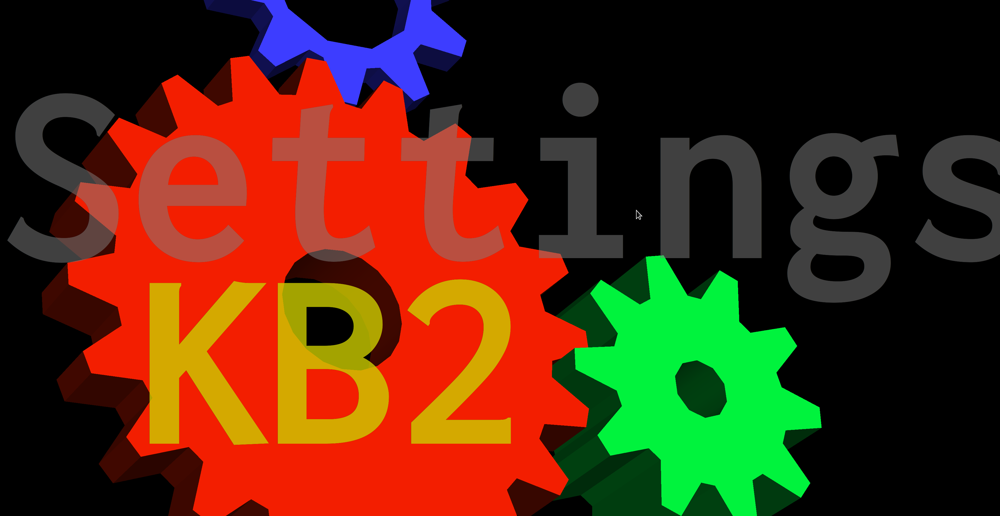

# OpenGL Graphics Injector

## Demo

### Injecting into SuperTuxKart

### Injecting onto glxgears

## What is this about?

This project serves as a sample on how to inject custom graphics ontop of
programs using OpenGL to render their imagery. A full instance of the cairo 2d rendering
system (which may be used in the new C++ graphics standard extension) is loaded
into the context of the started program and all functions of the rendering toolkit
can be used inside of a Lua environment, running next to the normal program.

## Features

  - Full color rendering of text, images and geometric shapes.
  - Live-updates.
  - Capturing keyboard inputs and prohibiting them from being entered into the game.
  - Possible application in the future: OCR of OpenGL based applications to be read aloud to visually impaired people.

